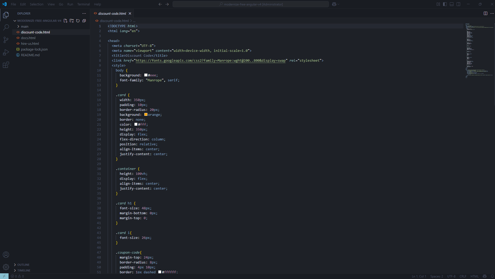

# Black Solarized Theme for Visual Studio Code

A dark, solarized-inspired theme for Visual Studio Code, offering a comfortable and eye-pleasing coding experience.

## Features

*   **Solarized Dark Palette:** A carefully crafted color scheme based on the popular Solarized palette, optimized for dark environments.
*   **Enhanced Readability:** High contrast and thoughtful color choices to reduce eye strain and improve code readability.

## Screenshots

## Installation

1.  **Download the VSIX file:**
    Download the latest `black-solarized-X.X.X.vsix` file from the [releases page on GitHub](https://github.com/SharojAdhikari/Solarized-Black/releases). *(Note: You'll need to create a release on GitHub for this link to be useful, or provide a direct link to the VSIX if hosted elsewhere.)*
2.  **Install from VSIX:**
    *   Open Visual Studio Code.
    *   Go to the Extensions view (Ctrl+Shift+X or Cmd+Shift+X).
    *   Click on the `...` (More Actions) menu in the top right of the Extensions sidebar.
    *   Select `Install from VSIX...`
    *   Navigate to where you downloaded the `.vsix` file and select it.

## How to activate the theme

1.  After installation, go to `File > Preferences > Color Theme` (or `Code > Preferences > Color Theme` on macOS).
2.  Select `Black Solarized` from the list.

## Repository

You can find the source code and contribute to this theme on GitHub:
[https://github.com/SharojAdhikari/Solarized-Black](https://github.com/SharojAdhikari/Solarized-Black)

**Enjoy your new Black Solarized theme!**
